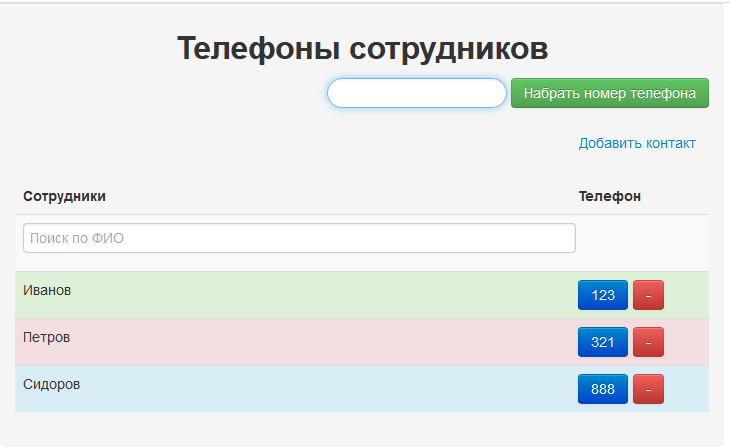

# Список контактов
Демонстрационный пример использования поиска на странице без перезагрузки с помощью React.
В качестве backend используется Go с базой данных на sqlite.
Go-приложение стартует в качестве web-службы (доступен по адресу http://localhost:8001) и обрабатывает http-запросы.
